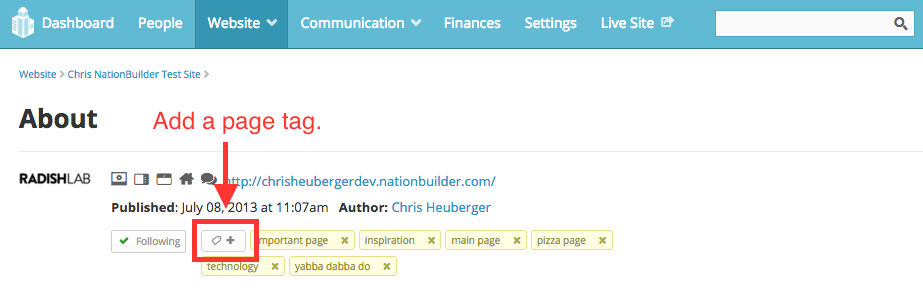



## Hello NationBuilder

To begin with [NationBuilder](http://nationbuilder.com/){:target="_blank"}, you'll want to set up an account (you can start with a free trial) and follow the instructions provided. You might take a look at their public themes [here](http://nationbuilder.com/public_themes){:target="_blank"} to see what's available out of the box.

{: .full-width}

The all-important docs are [here](http://nationbuilder.com/docs){:target="_blank"} and are organized the way NationBuilder dashboard is organized with separate categories for people, website, communication, finances, settings, and data.

If you need help or have a question to ask, their [support section](http://nationbuilder.com/support){:target="_blank"} includes [demos](http://nationbuilder.com/demos){:target="_blank"}, [workshops](http://nationbuilder.com/recorded_trainings){:target="_blank"} , and answers to just about any question you could have. There's also a sizable video library of [NationBuilder tutorials](https://vimeo.com/nationbuilder/videos){:target="_blank"}. But I would recommend starting with their [Intro to NationBuilder](http://nationbuilder.com/course_intro_to_nationbuilder){:target="_blank"} guided course to get a lay of the land.

For more advanced stuff, check out their [Developer blog](http://nationbuilder.com/developers){:target="_blank"} to learn more about their API.

<iframe src="https://player.vimeo.com/video/129819511?color=62b6cf&amp;title=0&amp;byline=0&amp;portrait=0" width="600" height="376" frameborder="0" allowfullscreen="allowfullscreen"></iframe>

When getting acquainted with NationBuilder, the control panel is a good place to start. This is where all aspects of your "nation" are managed. A nation can have many websites, but they can all be managed in one place and connected in useful ways here. The control panel includes a dashboard where you can monitor activity as well as the following items:

* The **People** section is your database where you can manage all interactions with anyone who has taken an action on your site. So if someone signs a petition, you can find them here and filter people in all sorts of ways to target certain groups.
*The **Website** section is where you build your site page-by-page. It's where you control content and everything that the user sees in the browser.
* **Communication** is where you manage outreach so anything related to email, text, or social media engagement lives here.
* **Finances** is where you can track donations, invoices, expenditures, and all transactions.
* **Settings** is where you make decisions that will apply to your nation globally. Not be confused with site settings which only pertain to your website, this section is more about creating memberships, setting permissions, connecting your bank account, and customizing high-level stuff.

### NationBuilder Website Basics

When you're just setting out creating a website, most of your time will be spent in that section. NationBuilder provides a well organized list of How Tos for customizing your site [here](http://nationbuilder.com/ht_website){:target="_blank"} and an [Architects blog](http://nationbuilder.com/designers){:target="_blank"} for diving deeper.

Under **Website > Pages**, you'll see some boilerplate template pages already there. When you create a new page here, be sure to choose its page type wisely. There are many options, and whichever one you choose will determine what that page will be set up to accomplish within your site. For example, a signup page type comes ready to collect user submissions, with the preloaded capability to customize a form however you need it. But you can't change a page's type after it's been created.

{: .full-width}

Now a bit about what's under the hood. NationBuilder is built with [Ruby on Rails](http://rubyonrails.org/){:target="_blank"} and uses PostgreSQL for its back-end database, but not much back-end expertise is needed. You also have solid front-end control as well as easy monitoring of comments and activity feeds, advanced spam blocking, reliable server scaling, recruiter and referral tracking, full control over SEO, and built-in Google Analytics.

NationBuilder uses [Theme Sync](http://nationbuilder.com/theme_sync){:target="_blank"} for developing locally on a Mac. Once you create a nation, you’ll want to download your new nation via Theme Sync. Then, you’ll have much greater access to your site's structure and functionality than the control panel affords you, although you’ll still switch back and forth with the control panel as some stuff can only be done there.

It’s also useful to remember the two levels of NationBuilder editing. [Theme-level editing](http://nationbuilder.com/theme_documentation){:target="_blank"} is modifying page types across your entire website. To do that from your control panel, go to **Website > Theme**. [Page-level](http://nationbuilder.com/how_pages_work){:target="_blank"} editing is modifying a specific page. This will override your theme level template. To do that, go to **Website > Template**.

The most important template files in a NationBuilder project are:

*   **layout.html** wraps every page and includes header and footer.
*   **_columns_1.html** wraps the main content area of a page when the sidebar is turned off.
*   **_columns_2.html** wraps the main content area of a page when the sidebar is turned on.
*   **_nav.html** is the top navigation include.

And the most important stylesheets are:

*   **_variables.scc** contains all defined colors and settings.
*   **theme.scss** is the mobile first stylesheet which controls the overall look of your website.
*   **_navs.scss** contains base navigation styles.
*   **_navbar.scss** contains navigation bar styles.

Familiarize yourself with those files and check out what else lives in a nation’s theme and site folders and you’ll have a good understanding of everything that goes into a NationBuilder website.

## Getting a Feel for Liquid

In addition to SCSS and JavaScript, NationBuilder uses the open source templating engine called [Liquid](https://github.com/Shopify/liquid/wiki/Liquid-for-Designers){:target="_blank"} to access objects and variables. Liquid is based in [Ruby](https://www.ruby-lang.org/en/){:target="_blank"} and was first developed for [Shopify](https://www.shopify.com/){:target="_blank"}. The two basic types of Liquid markup are **output** and **tags**.

1.  Output variables are used to display dynamic content and are surrounded by double curly brackets <code>{{ like this }}</code>. This format is replaced with the data it references and may resolve to text.
2.  Tag markup is surrounded by curly brackets and percent signs <code></code>. This format is used to define logic like for loops or branching and does not resolve to text.

### Now for a Few Examples

#### Liquid Output Example 1

When outputting content, you can add all sorts of filters which are simple methods to manipulate data. So to reformat a date syntax reference, you could write:

{{ event.event.local_start_at | date: '%A, %B %d, %Y at %I:%M %p' }}

The above line will display the date in this format: "Friday, January 1, 2018 at 8:30pm”

#### Liquid Output Example 2

You could also string filters together. Here, I’m using the `truncatewords` and `upcase` filters:

{{ post.headline | truncatewords: 10 | upcase }}

This would limit the amount of words displayed from the post headline to 10 and then convert that string to all capital letters.

#### Liquid Output Example 3

Or you could add content to the beginning or end of any output:
  
{{ page.headline | prepend: 'by Author' | append: ''}}

This line prepends the words "by Author" in front of the page headline output and then appends an image at the end of it. And now for a few Liquid *logic* examples.

#### Liquid Logic Example 1



This will display the content of the **_features.html** partial template with the settings of the **page_slug** in question. So that Liquid code would go in an HTML template file. 

#### Liquid Logic Example 2



  <h2>Welcome to the homepage.</h2>



This code uses the operator `==` to check if the user is on the homepage and displays a message accordingly.

#### Liquid Logic Example 3



  <h2>Welcome, thanks for becoming a member!</h2>



The above would show the greeting only if a user had new_member among their tags.

#### Liquid Logic Example 4

You could also use a Liquid logic tag to cycle through a series and output the same piece of code for each instance.


<ul>
  
    <li>{{ child.name }}</li>
  
<ul>


Here, we create a full list of a certain page’s subpages.

### How Liquid is Used in NationBuilder

Liquid works by adding page, user, site, and request variables into a page or a template file. For example, if you ever wanted to retrieve the name or login status of your user or the URL path of the current page, you would use a Liquid [request variable](http://nationbuilder.com/request_variables){:target="_blank"}. One important distinction to make about the NationBuilder CMS is that user actions are taken using different NationBuilder page types, rather than widgets or plugins. So to create a petition, event page, or general signup page, you'd create a new page with that type. Here are a couple useful documentation links:

*   [Liquid Basics](http://nationbuilder.com/liquid_basics){:target="_blank"}
*   [Liquid Object Reference](http://nationbuilder.com/liquid){:target="_blank"}

{: .full-width}

It's pretty impressive how much Liquid can accomplish. For example, you can see that the **layout.html** file already contains <code>{{ content_for_header }}</code> in its head tags as well as <code></code> and <code>{{ content_for_footer }}</code> in its body tags, all of which load jQuery scripts, metadata, and other critical code.

## Pages and People

### Page Variables

For any page, you’ll be able to call a range of [page variables](http://nationbuilder.com/page_variables){:target="_blank"}.

Stick this snippet on any page to list out what each variable is for that particular page:



  <h2>For Reference</h2>
  
    
page excerpt = <strong>{{ page.excerpt }}</strong>

  
    
<strong>There is no page excerpt.</strong>

  
  
page ID = <strong>{{ page.id }}</strong>

  
page title = <strong>{{ page.title }}</strong>

  
page name = <strong>{{ page.name }}</strong>

  
tage type name = <strong>{{ page.type_name }}</strong>

  
type of page slug = <strong>{{ page.type_slug }}</strong>

  
page type icon = <strong>{{ page.icon | icon }}</strong>

  
    
page author = <strong>{{ page.author.published_name }}</strong>

  
    
<strong>This page does not have an author.</strong>

  
  
When this page was published = <strong>{{ page.published_at | date: '%b %d, %Y %l:%M %p' }}</strong>

  
Does the site have a primary image? = <strong>{{ page.has_meta_image? }}</strong>



That will give you an idea of what you're working with and provide a sense of what gets passed through to a page.

### Tagging Pages and People

When you set up a new page on NationBuilder, you can add a tag to people under the settings tab of that new page. In the control panel for a page or person, there is a button to tag that page. A tag can also be added automatically when a person takes an action on your website or contacts a broadcaster.

##### Here's where you can add a people tag:

{: .full-width}

##### And here's where you can add a page tag:

{: .full-width}

The <code></code> logic tag is used to associate pages with a specific page tag with an HTML snippet for display.

#### Page Tag Example

If you had this code on a page:



adding the tag <code>show meta image</code> to that page would cause it to render the HTML file **_partial_meta_image_snippet.html**. The leading underscore is necessary in the filename when including snippets, but is not included in the Liquid call itself. Adding the prefix "_partial" to all partial snippets is not necessary but is a good way to organize them in your file listing.

Then, this line in **_partial_meta_image_snippet.html**:



would render that page’s meta image via the code in the HTML snippet.

### Using Page Tags for Theme-Level Customizing

By adding and removing page tags, you can easily customize page content and layouts.

#### Step 1: Create a Liquid Variable for a Page’s Tags

To customize our template based on a page’s tags, we’ll first enable NationBuilder’s theme engine to recognize those tags.

By default, NationBuilder Liquid variables include one named `page.tags`, an array of page tags. But you’ll need those tags in a list format to enable NationBuilder’s theme engine to recognize and search for them. This code creates a new variable called `tags_list` and tells NationBuilder its value is a full list of the page’s tags, separated by commas.

   

This tells NationBuilder that `tags_list` is now a list of the page’s tags.

#### Step 2: Choose Your Tags

Before you code your templates, it's a good idea to map out and record [what each tag will do](http://nationbuilder.com/creating_a_tag_library){:target="_blank"}.

#### Step 3: Code Your Template

Use if statements to query whether the page has a particular tag, and show or hide the content accordingly:



  show custom content



#### Step 4: Add Your Custom Tag to the Page

Then just add or remove tags to a page in the control panel to govern its content.

Note: If changes don’t appear, NationBuilder may have just cached the page. Try manually [clearing the site’s cache](http://www.refreshyourcache.com/en/home/){:target="_blank"} to see if that solves the problem before debugging your code.

There, now you know the basics of Liquid and NationBuilder!
