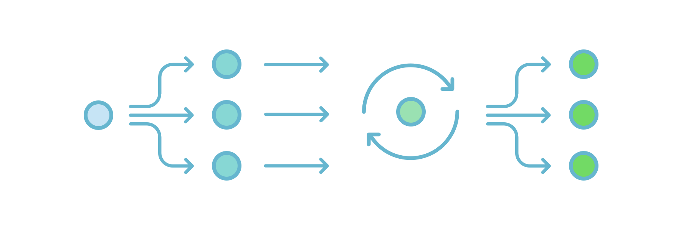
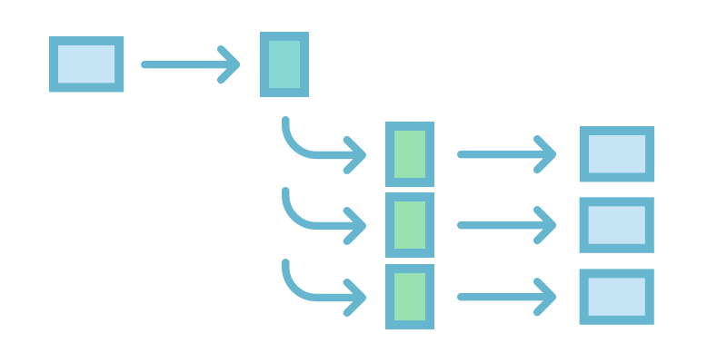
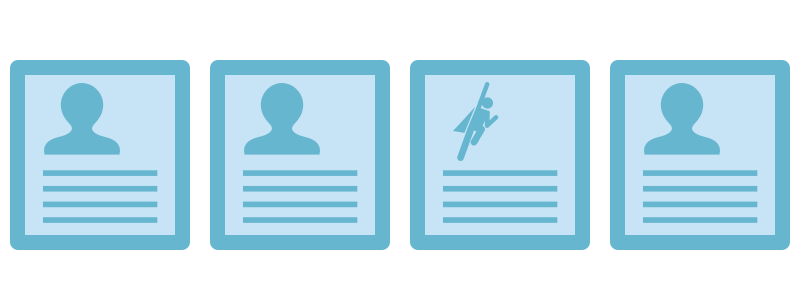
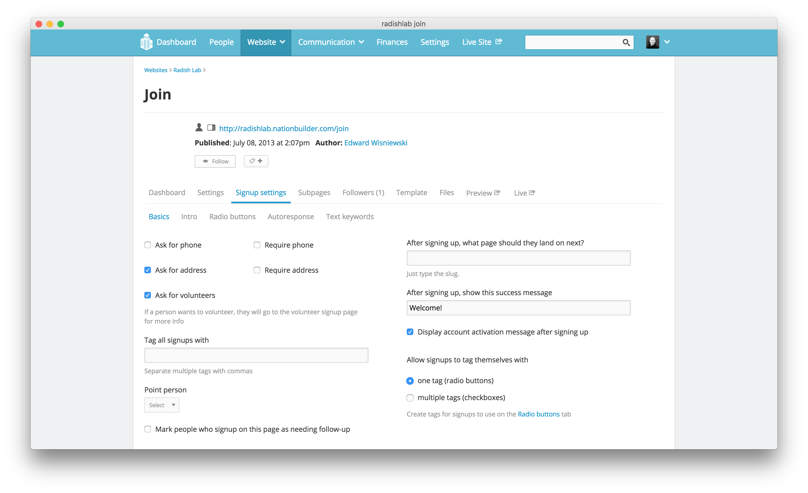



## Conditionals and For Loops

### Conditionals

Conditionals, or "if statements", are when you say, "I'll do this under one condition." Let’s begin with a few basic if statements.


{% if user.name == 'Mika' }
  Hello Mika
{% elsif user.name == 'Kygo' }
  Hello Kygo
{% endif }


or



  Thank you for volunteering!

  Will you volunteer?



Both of these examples use a Liquid object to determine something about the user and display different content based on that information. Building on that, let’s see how to target a user’s membership type using conditionals.

For example, to make certain pages (or parts of pages) only viewable to certain membership types, first set up [membership types](http://nationbuilder.com/create_membership_types){:target="_blank"} in your nation. Next, add a member type in the NationBuilder control panel called "Sustaining". Lastly, wrap your page content inside Liquid conditionals that check for membership levels or tags—or otherwise hide the content—like this:



  <!-- Paying Member Content -->

  <!-- Non Paying Member Content -->



### For Loops

{: .full-width}

For loops are great for quickly targeting a group of pages or posts.

#### For Loop Example 1

You could use a for loop to access a page's children with the the page.children object.

So this would go in the parent page’s template:



  {{ page.slug }}



And that would list the slug of each subpage.

#### For Loop Example 2

Images that are uploaded to the **Files** section of a page (attachments) are accessible in a for loop this way:



  



The above code could go in a partial **named _gallery.html** and if a page had <code></code>, it would display all the images that have been uploaded to that page.

#### For Loop Example 3

If you want to cycle through iterations where the tag issue is used and show the content only on the homepage, you could put this in **layout.html**:



  



in **_homepage_content_block.html**:



  
page slug: {{ page.slug }} 

  
 page name: {{ page.name }}

  
 author%u2019s first name: {{ page.author.first_name }}




<code>most_recent_published_pages_no_pagination</code> will give you a list of the most recently updated 500 pages, and the tag prefix lets it access the <code>tag_slug</code> used in the original <code></code> call.

#### For Loop Example 4

Similarly, this is a for loop that will display an attachment images within a feed of pages with a certain tag:



  



So if the code above was in a partial named **_show_books.html**, than this line would go in a template file:



And that would display the first image from each of the 3 most recently published pages tagged with books.

### Now Let’s Bring Them Together

{: .full-width}

We’ll end with a simple example of an if statement inside a for loop:


{% for child in page.children }
  {% if child.type_name == 'Question' }
    <li><a href="{{ child.url }}">{{ child.headline }}</a></li>
  {% endif }
{% endfor }


This code would iterate over every subpage for a particular page and for any whose name contained the word “Question”, that page’s headline would be displayed as a list item link to the page.

When it comes to Liquid logic, keep it simple and separated in clean chunks. If it helps, draw or write out your process in pseudo code. Think explicitly about what you want to end with and what you’re able to target to begin with. Pretty soon, you’ll find for loops and conditionals useful thinking tools for any problem.

## Images, Assets, and Scripts

Now let's look at some useful concepts and techniques for working with images and subpages.

{: .full-width}

All images or assets used for a specific page only should be uploaded to **Website > Template > Files** but any images or assets used for your overall theme should be uploaded to **Website > Theme > Files**. No path is necessary when referencing images or assets in your theme template:






.example { background-image: url('myfile.jpg'); }


Upload script files here too and then reference them at the bottom but inside the body tag in **layout.html**:



</body>
</html>


If you need to link a file to an absolute URL, upload the file to NationBuilder, then right click on it and choose **Copy Link Address**. That link will look something like this:


https://nationslug.nationbuilder.com/assets/pages/1/filename.jpg


If you are referencing an image or file within a `<script>` tag, upload the file to **Website > Theme > Files** and use the following code:


{{ theme['myfile.jpg'] }}


### Attachments vs Meta Images

An attachment is a file that is uploaded to the **Files** section of a page. The meta image is defined under the **Social Media** section of the **Page Settings** tab, and is used primarily to define a meta image for use when sharing on Facebook, Twitter, etc. A page can have only one meta image, but can have multiple attachments.

[These snippets](http://nationbuilder.com/liquid_template_examples#imagefeed){:target="_blank"} can be used to display images from a page when you don’t know the filename but know that the files will be attachments on that page, which is why they’re housed in for loops.

## Subpages

{: .full-width}

When dealing with subpages, you can loop through them to display each one or elements from each one on the main parent page. You’d be accessing the <code>page.children</code> object by means of a for loop. So you’d place this in the parent page’s template:



  {{ page.slug }}



The above code would list the slug of each subpage.

#### Subpage Example 1

You could use the <code></code> tag to access an attachment on another page. If the attachment is on **page1** and you want to call it on **page2**, put this line on **page2**:





and then **_partial_attachment_include.html** would contain:



  
    
  



In this case, **page2** would see the subpage command, run **page1** through the logic in the above HTML snippet, which would cycle through **page1**’s attachments, and only render if an **attachment.url** included "header".

#### Subpage Example 2

If you have an image named **header.jpg** in the files section of a page with slug **page_a**, you could create a file named **_partial_image_call.html** which contained:





and that would allow you to call that image from anywhere else by putting this line on any page you wanted the image to appear:





You can only use the line in that partial in conjunction with the **subpage** call but note that the **subpage** tag does not require that a page be the child of another to work.

And there you have an overview on where to store images and assets on NationBuilder and how to call them up no matter what page you’re on. Next, let's go over how to handle users taking action on your site.

## Signups and Actions

We’ll start in the NationBuilder Control Panel, where you can customize action settings for any action page type.

### Action Settings

{: .full-width}

Many NationBuilder page types allow for visitors to take an action like sign a petition, make a donation, or RSVP to an event. And for each action, there are settings you can control by going to **[Page name] > Settings > [Action] settings**. So for a page with page type **Signup**, that tab would be labeled **Signup settings**. This is where you can do things like automatically add tags to any person who signs up on your site.

To add or remove a tag associated with a signup form, go to: **Signup settings > Radio buttons**. You can allow users to select multiple tags here: **Signup settings > Basics** in which case the **Radio buttons** section will be renamed **Checkboxes**. For more info, check out how to [create a new tag for a signup form](http://nationbuilder.com/how_to_signup#create){:target="_blank"}.

## Data and Forms

{: .full-width}

Very often, you'll want a field in your form that NationBuilder doesn’t have as a default. To include such a field, you’ll need to do a bit of customizing.

The first step to customizing forms is knowing how to direct the data to the correct place. Data from forms are either stored in one of the already existing signup fields ([signup variables](http://nationbuilder.com/signup_variables){:target="_blank"}) or in [custom fields](http://nationbuilder.com/when_to_use_custom_fields){:target="_blank"}.

{: .full-width}

To allow users to signup for an email blast, for example, you would create a signup page (or use the existing join page) to control the settings (tag, path, followup, membership assignments, redirects after form submission, whether or not autoresponses are triggered, etc.), and then create a partial HTML template to control the form fields you’d be asking for. You’d associate the two via either the `subpage` or `include` Liquid tags.

#### Signup Form Example





This associates a partial HTML template (**_signup_form.html** in the theme files section) with the site’s default signup page. So **_signup_form.html** would then contain:



  
    

      Hi <strong>{{ request.current_signup.name_or_email }}.</strong>
       
      

        Sign in with <a href="{{ request.facebook_connect_url }}">Facebook</a>, <a href="{{ request.twitter_connect_url }}">Twitter</a> or <a href="/login">email</a>.
         
        Not {{ request.current_signup.name_or_email }}? <a href="{{ request.current_signup.logout_url }}">click here</a>.
      

    

  
    

      
        
        


        
        

      
    

  


The above code first checks for login status. If the user isn’t logged-in, it would display only the email address field. Then, the form housed in this partial would be submitted through the associated page (default signup page in this case).

There are a lot of moving parts in a NationBuilder website and following the chain of command can be tricky with all the partials and subpages involved. But there's also lots of resources out there to help you figure out any task. This collection of [Liquid Snippets](http://nationbuilder.com/liquid_template_examples){:target="_blank"} is mighty handy when it comes to specific, slightly more advanced functionality. Good luck!
