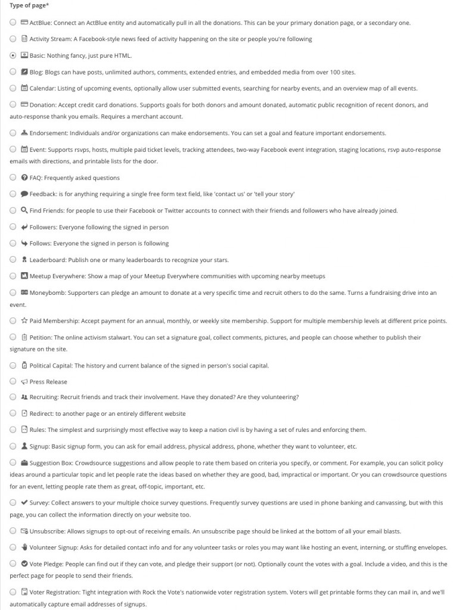

## The Fundamentals of NationBuilder



# Hello NationBuilder

[NationBuilder](http://nationbuilder.com/website){:target="_blank"} is a powerful tool for organizing people online. But just what does that mean?

Well you can think of it as a platform for making websites that also provides a host of integrated tools to help coordinate communities around a common goal, with the website as one part of a multifaceted approach. So in that way, NationBuilder is conceptually different from other platforms on the web and quite a bit more ambitious. It connects your site to a ready-made framework for organizing, coordinating, and communicating with users. It also includes powerful financial tools necessary for many initiatives, and provides optimal control over how it all goes together. NationBuilder serves up an impressive breadth and depth of functionality while still being incredibly customizable, scalable, and flexible.

And that is no easy feat.

For a product like this to be universally adaptable, it has to make trade-offs, which can be limiting. So you need to be aware of its restrictions as well as its functional attributes. NationBuilder is a complex piece of software, but the more you work with it, the more you see the thought that went into making every piece connect as seamlessly as possible. Radish Lab is now a certified NationBuilder [architect](http://nationbuilder.com/radishlab){:target="_blank"} so yes, I am biased. We don’t recommend NationBuilder for every project, but it can be a great option for certain types of clients, including nonprofits, educational institutions, advocacy groups, and political organizations; anyone who wants to raise funds, hold an event, boost awareness, spark action, or create a movement.

<iframe src="https://player.vimeo.com/video/129819511?color=62b6cf&amp;title=0&amp;byline=0&amp;portrait=0" width="600" height="376" frameborder="0" allowfullscreen="allowfullscreen"></iframe>

## NationBuilder Website Basics

When getting acquainted with NationBuilder, the control panel is a good place to start. This is where all aspects of an organization’s community are managed. It includes a Dashboard where you can monitor activity as well as sections for the website itself, people, communication, finance, and general settings. A nation can have many websites, but they can all be managed in one place and connected in useful ways here.

The control panel is where most general organization of a website happens. For example, when you create a page here, be sure to choose its page type wisely. There are many options, and whichever one you choose will determine what that page will be set up to accomplish within your site. For example, a signup page type comes ready to collect user submissions, with the preloaded capability to customize a form however you need it.

I'm going to get a bit technical here, so proceed with caution.

NationBuilder is built with [Ruby on Rails](http://rubyonrails.org/){:target="_blank"} and uses PostgreSQL for its back-end database, but not much back-end expertise is needed. You also have solid front-end control as well as easy monitoring of comments and activity feeds, advanced spam blocking, reliable server scaling, recruiter and referral tracking, full control over SEO, and built-in Google Analytics.

NationBuilder uses [Theme Sync](http://nationbuilder.com/theme_sync){:target="_blank"} for developing locally on a Mac. Once you create a nation, you’ll want to download it via Theme Sync. Then, you’ll have much greater access to what’s under the hood than the control panel affords you, although you’ll still switch back and forth with the control panel as some stuff can only be done there. It’s also useful to remember the two levels of NationBuilder editing. Theme-level editing is modifying page types across your entire website. To do that from your control panel, go to **Website > Theme**. Page-level editing is modifying a specific page. This will override your theme level template. To do that, go to **Website > Template**.

In addition to SCSS and Javascript, NationBuilder uses the open source Liquid template language to access objects and variables. Liquid is based in [Ruby](https://www.ruby-lang.org/en/){:target="_blank"} and was first developed for [Shopify](https://www.shopify.com/){:target="_blank"}. The two basic types of liquid markup are output and tags. Output variables are used to to display dynamic content. They are surrounded by <code>{{</code> two curly brackets <code>}}</code> and are replaced with the data they reference. Tags are put inside <code>{%</code> a curly bracket and a percent <code>%}</code> and are used to define logic like for loops or branching logic.

Here’s an example of some liquid template logic:



This will display the content of the **_features.html** partial template with the settings of the **page_slug** in question. So that Liquid code would go in an HTML template file. The most important template files in a NationBuilder project are:

*   layout.html wraps every page and includes header and footer.
*   _columns_1.html wraps the main content area of a page when the sidebar is turned off.
*   _columns_2.html wraps the main content area of a page when the sidebar is turned on.
*   _nav.html is the top navigation include.

And the most important stylesheets are:

*   _variables.scc contains all variables.
*   theme.scss is the mobile first stylesheet which controls the overall look of your website.
*   tablet-and-desktop.scss are the styles for people viewing the site on tablet and desktops.
*   _navs.scss contains base navigation styles.
*   _navbar.scss contains navigation bar styles.

Familiarize yourself with those files and check out what else lives in a nation’s theme and site folders and you’ll have a good understanding of everything that goes into a NationBuilder website. In my next post, I’ll be providing some specific tips and tricks for developing themes on NationBuilder so stay tuned to learn how to customize that website!

# Liquid Basics

In my [previous post](http://radishlab.com/2015/10/a-practical-introduction-to-nationbuilder/){:target="_blank"}, I went over some high-level key concepts as an introduction to the [NationBuilder](http://nationbuilder.com/){:target="_blank"} platform. Now, and over my next few articles, I’ll go a bit deeper on the development side with some examples of how to solve common issues on NationBuilder and share lessons I’ve learned along the way. I’ll also provide a few code snippets designed to give you some insight into how NationBuilder works under the hood.

So consider this an introductory series, covering the fundamentals of developing on NationBuilder, with—hopefully—a few tips and tricks everyone can use. And as always, let me know what you think!

## Getting a Feel for Liquid

To start off with some basics, NationBuilder uses a templating language called Liquid, which has two types of markup: **Output** and **Tag**.

1.  Output markup is surrounded by double curly brackets <code>{{ like this }}</code>. This format may resolve to text.
2.  Tag markup is surrounded by curly brackets and percent signs <code></code>. This format does not resolve to text.

#### Liquid Output Example 1:

When outputting content, you can add all sorts of filters which are simple methods to manipulate data. So to reformat a date syntax reference, you could write:

{{ event.event.local_start_at | date: '%A, %B %d, %Y at %I:%M %p' }}

The above line will display the date in this format: "Friday, January 1, 2016 at 8:30pm”

#### Liquid Output Example 2:

You could also string filters together. Here, I’m using the `truncatewords` and `upcase` filters:

{{ post.headline | truncatewords: 10 | upcase }}

This would limit the amount of words displayed from the post headline to 10 and then convert that string to all capital letters.

#### Liquid Output Example 3:

Or you could add content to the beginning or end of any output:
  
{{ page.headline | prepend: 'by Author' | append: ''}}

This line prepends the words "by Author" in front of the page headline output and then appends an image at the end of it. I’ll get more into Liquid logic for looping and branching in my next post but here are two basic examples.

#### Liquid Logic Example 1:



  <h2>Welcome to the homepage.</h2>



This code uses the operator == to check if the user is on the homepage and displays a message accordingly.

#### Liquid Logic Example 2:


{% if request.current_user.tags contains %u2018new_member%u2019 %}
  <h2>Welcome, thanks for becoming a member!</h2>



The above would show the greeting only if a user had new_member among their tags.

#### Liquid Logic Example 3:

You could also use a Liquid logic tag to cycle through a series and output the same piece of code for each instance.


<ul>
  
    <li>{{ child.name }}</li>
  
<ul>


Here, we create a full list of a certain page’s subpages.

## How Liquid is Used in NationBuilder

Liquid works by adding page, user, site, and request variables into a page or a template file. One important distinction to make about the NationBuilder CMS is that actions are taken using different NationBuilder page types, rather than widgets or plugins. So to create a petition, event page, or general signup page, you'd create a new page with that type. Here are some useful documentation links:

*   [Liquid Basics](http://nationbuilder.com/liquid_basics){:target="_blank"}
*   [Liquid Object Reference](http://nationbuilder.com/liquid){:target="_blank"}
*   [Liquid Snippets](http://nationbuilder.com/liquid_template_examples){:target="_blank"}

You’ll see Liquid is doing most of the work when you set up your nation. In my previous post, I gave a quick rundown of the most important template files. Getting a sense of how they’re all organized and connected will help big time.

To start though, just note that content that you want be on every page should go in the **layout.html** file. You’ll see this file already contains <code>{{ content_for_header }}</code> in its head tags as well as <code></code> and <code>{{ content_for_footer }}</code> in its body tags, all of which load jQuery scripts, meta data, and other critical code.

## Page Variables

For any page, you’ll be able to call a range of [page variables](http://nationbuilder.com/page_variables){:target="_blank"}.

Stick this snippet on any page to list out what each variable is for that particular page:



  <h2>For Reference</h2>
  
page excerpt =  <strong>{{ page.excerpt }}</strong>  <strong>There is no page excerpt.</strong>

    
page ID = <strong>{{ page.id }}</strong>

    
page title = <strong>{{ page.title }}</strong>

    
page name = <strong>{{ page.name }}</strong>

    
tage type name = <strong>{{ page.type_name }}</strong>

    
type of page slug = <strong>{{ page.type_slug }}</strong>

    
page type icon = <strong>{{ page.icon | icon }}</strong>

  
    
page author = <strong>{{ page.author.published_name }}</strong>

  
    
<strong>this page does not have an author.</strong>

  
    
when this page was published = <strong>{{ page.published_at | date: '%b %d, %Y %l:%M %p' }}</strong>

    
does the site have a primary image? = <strong>{{ page.has_meta_image? }}</strong>



## Tagging Pages and People

When you set up a new page on NationBuilder, you can add a tag to people under the settings tab of that new page. In the control panel for a page or person, there is a button to tag that page. A tag can also be added automatically when a person takes an action on your website or contacts a broadcaster.

The <code></code> logic tag is used to associate pages with a specific page tag with an HTML snippet for display.

#### Page Tag Example:

If you had this code on a page:



adding the tag <code>show meta image</code> to that page would cause it to render the html file **_partial_meta_image_snippet.html**. The leading underscore is necessary in the filename when including snippets, but is not included in the liquid call itself. Adding the prefix "_partial" to all partial snippets is not necessary but is a good way to organize them in your file listing.

Then, this line in **_partial_meta_image_snippet.html**:



would render that page’s meta image via the code in the HTML snippet.

## Using Page Tags for Theme-Level Customizing

By adding and removing page tags, you can allow clients to easily customize page content and layouts.

By default, NationBuilder liquid variables include one named `page.tags`, an array of page tags. But you’ll need those tags in a list format to enable NationBuilder’s theme engine to recognize and search for them. This code creates a new variable called `tags_list` and tells NationBuilder it’s value is a full list of the page’s tags, separated by commas.

   

Then you can use if statements to query whether the page has a particular tag, and show or hide the content accordingly.

#### Example:


{% if tags_list contains %u201Csample tag%u201D %}
  show custom content



Then just add or remove tags to a page to control its content.

That’s all for now on Liquid basics. Check back soon for the next installment on for loops and conditionals. And if you have any questions or need some help with your site, just [reach out](mailto:chris@radishlab.com){:target="_blank"}, and we’d be glad to help!
